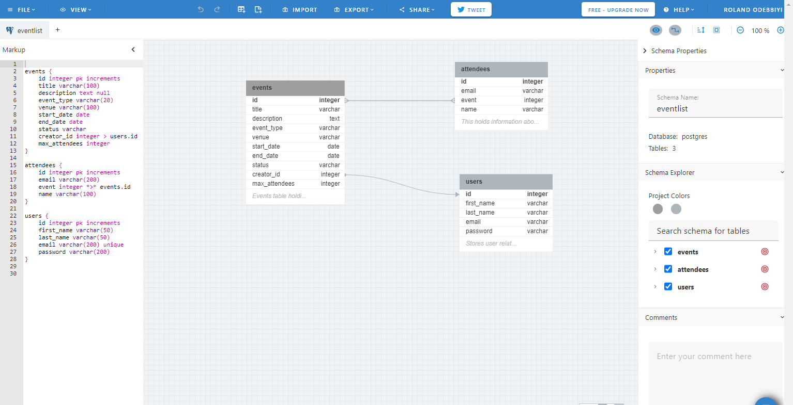
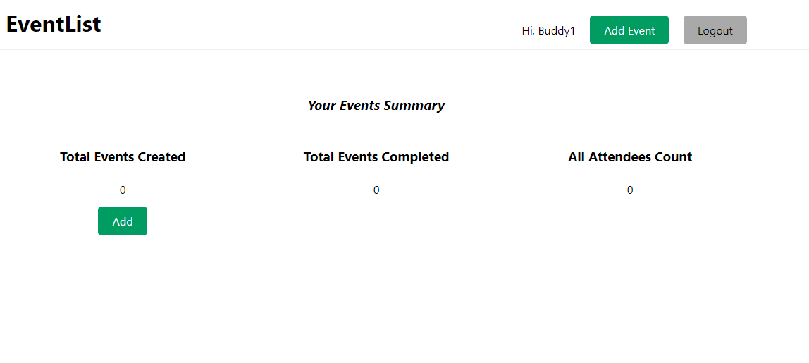
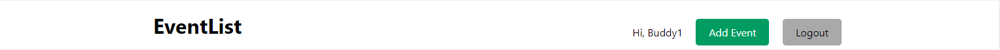
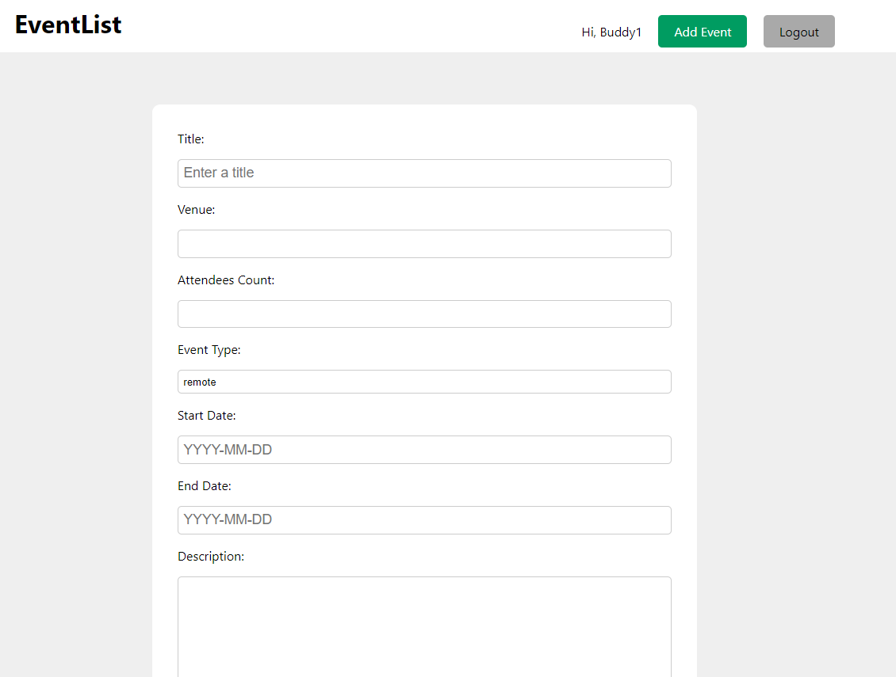
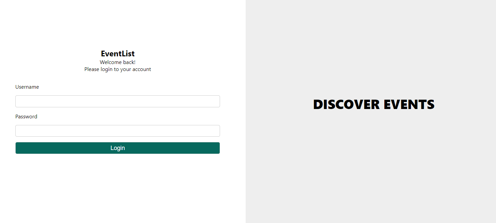
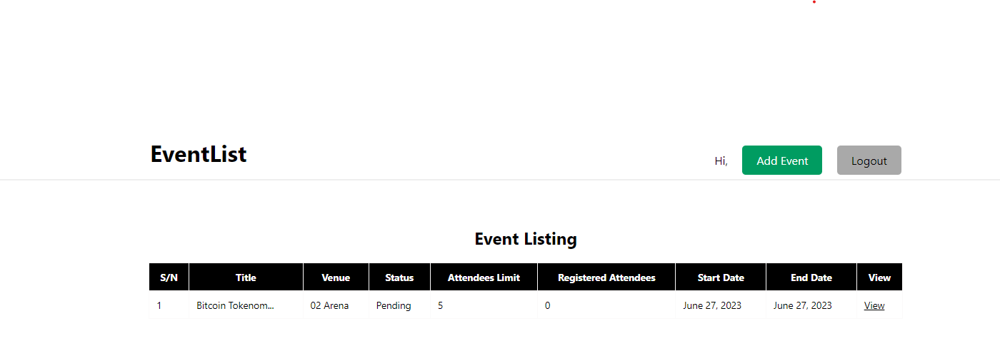

# EventList

## Table Of Contents
1. [Introduction](#Introduction)

2. [UX](#UX)
    1. [User Stories](#User-Stories)
    2. [Design Thinking](#Design-Thinking)
    3. [Scope Plane](#Scope-Plane)
3. [Features](#Features)
    1. [Design Features](#Design-Features)
    2. [Existing Features](#Existing-Features)
    3. [Future Adaptations](#Future-Adaptations)
4. [Issues and Bugs](#Issues-and-Bugs)
5. [Technologies Used](#Technologies-Used)
    1. [Main Languages Used](#Main-Languages-Used)
    2. [Frameworks, Libraries & Programs Used](#Frameworks,-Libraries-&-Programs-Used)
6. [Testing](#Testing)
    1. [Testing.md](TESTING.md)
7. [Deployment](#Deployment)
    1. [Deployment.md](DEPLOYMENT.md)
8. [Credits](#Credits)
    1. [Content](#Content)
    2. [People](#People)
9. [Acknowledgements](#Acknowledgements)
***

## Introduction
# EventList

Welcome to EventList, your destination for event listings and management.

## UX Development Plane
### User-Stories

Site user needs can broadly be split 2 epics:

- authentication
- events creation

AUTHENTICATION
- **As a** Administrator, **I want** to be able create user accounts from the command line, **so that** I can efficiently manage user access to the system
- **As a** website User, **I want** to be able create an account on the website by providing my username, email, password, and confirming the password **so that** I can access and use the platform

- **As a** website User , **I want** to receive a confirmation message after registering for an account **so that**  I can be assured that my account has been successfully created and I can start managing my events

- **As a** Website User, **I want** the ability to login in to the website using the provided login form  **so that** I can engage with the platform

- **As an** Adminiatrator, **I want** the ability to access the administrative dashboard through a dedicated URL login  **so that** it allows for a secure and convenient means of managing the system

EVENT CREATION

- **As an** Account User , **I want** to create events on the platform **so that**  I can share the events information with others

- **As an**  Account User, **I want**  I want to see a list of events I have created **so that** I can keep track of my events and make any necessary updates

- **As an** Account User, **I want** the ability to delete events I have created **so that**  I can remove events that are no longer relevant

- *As an* Account User, **I want** to ensure that only administrators can delete events that I have created **so that** unauthorized deletions are prevented

- *As an* Account User, **I can** I want to see a list of attendees for events I have created **so that** I an see the guest list and make event preparations

- *As an* Accont User, **I want** to be able to edit details of events I have created **so that** I can make updates or corrections as needed

- *As a* Guest User, **I want**  to be able to book tickets for a specific event **so that**  I can secure my spot and attend the event that I am interested in

### Design Thinking

Employing a Design Thinking methodology, the student developer opts to explore various features perceived as most valuable by users on the finalized site. As specified in the assessment criteria, this project mandates the use of CRUD functionality, providing a fundamental structure for necessary functionalities. A preliminary evaluation has generated the following insights:

| Feature                                 | Importance | Feasibility |
|:----------------------------------------|:----------:|:-----------:|
| Creating an event                       |     5      |    5        |
| Viewing events created                  |     5      |    4        |
| Deleting events                         |     5      |    5        |
| Viewing events attendee                 |     4      |    5        |
| Editing events                          |     5      |    5        |
| Searching for an Event                  |     5      |    4        |
| Booking a Ticket to attend Event        |     5      |    4        |
| Account User Registration               |     5      |    5        |
| Admin login                             |     5      |    5        |
| **Overall Score**                       |   **44**   | **42**      |

### **Color Schema**   
The  color shema was selected from [Coolors](https://coolors.co). The idea was to have combinations of colors.   
 

### **Typography**  
All of the fonts were sourced from [Google Fonts](https://fonts.google.com).   
* Main fonts: Verdana sans-serif   
  A sans-serif type of font was chosen to give a simple, clean, and modern look to the site. 

## Database Design

Database schema was designed using [dbdesigner](https://erd.dbdesigner.net/).   
  

## Scope Plane

* **Functional Requirements**   
User Authentication:  
    - The system shall allow an Administrator to create user accounts via the command line interface.
    - Users shall be able to create accounts on the website by providing username, email, password, and confirming the password.
    - Upon successful registration, users should receive a confirmation message to verify account creation.

    ### Login Functionality:
    - Users shall be able to log in to the website using the provided login form.
    - An Administrator should access the administrative dashboard via a dedicated URL login for secure system management.

Event Management:
    - Account Users shall have the capability to create events on the platform.
    - Users must have visibility of a list of events they've created, enabling them to track and update event details
    - Users should be able to delete events they've created, with restrictions to ensure only administrators can delete events created by others.
    - Account Users should view and manage the attendee list for events they've created.
    - Editing functionalities for event details should be available to Account Users.

Ticket Booking:
    - Guest Users must be able to book tickets for specific events.

* **Non-Functional Requirements**  
Security:
   - User authentication and sensitive information transmission (e.g., passwords) should be encrypted and secure.
   - Access control mechanisms should restrict unauthorized access to sensitive functionalities (e.g., event deletion).

Performance:
   - The system should respond promptly to user actions, ensuring minimal latency during event creation, updates, and bookings.

User Experience (UX):
   - The user interface should be intuitive, guiding users through registration, event creation, and management processes.

   - Responsive design principles should be employed to ensure usability across various devices and screen sizes.

Compatibility:
   - The web application should be compatible with major browsers (Chrome, Firefox, Safari, etc.) to ensure a seamless user experience.

Skeleton
Wireframes were made to showcase the appearance of the site pages while keeping a positive user experience in mind. The wireframes were created using a desktop version of [Balsamiq](https://balsamiq.com/).

Balsamiq Wireframes

    

   

[Back to top](#Mutts-Cuts)

## Features

**MAIN SITE FEATURES**
### Design Features

### Existing Features

Home Page
The home page immediately inform the users of the purpose of the webite. 

Navigation 
The navigation bar included hypertext links to four pages: the home page (represented by the logo), the Add Event page, the login page, and the sign-up page."

Add Event Page
The "Add Event" page enables registered users to create an event for listing purposes.

The Logout Page
The logout page redirects users back to the home page.

View Event Button on Home Page
Once users have added events, they can access the event list by clicking a button on the home page.

View Tab on 

If user is logged in, an additional `Book Now` button becomes available.  This is a short cut to the *view booking* template.

To enhance user experience, buttons change style when hovering.

Additionally the registration and logon CTA buttons are hidden when a user is authenticated.  They aren't required in this context.

To enhance user experience, buttons change style when hovering.

Services Page

Contains a brief synopsis of the services offered, drawn from the backend Services table.

A carousel element with 3 images has been included to make the site feel more dynamic.

Registration Page

Standard allauth signup page adapted to the site's theme.

Login Page

Standard allauth signup page adapted to the site's theme.

View bookings page
This shows the user all existing bookings.  It is intended that that they use this information to book an appointment that doesn't overlap with an existing one.

All accounts can:
- view a page personalised with their username
- view bookings from the current date to one year in the future
- filter the table using a jQuery support date picker. This has been setup to allow selections from current date to one year in the future.
- `Show all` button removes filtering and restores table to default.
- create a booking by selecting `Book Now`
- the table itself utilizes a hover effect for a whole row to emphasis the record the user is actively viewing/selecting.

Superuser and staff accounts have:
- full CRUD access to all bookings made.
- can view all booking information including user names

Standard user accounts have:
- CRUD functionality limited to their own records. This is to counter malicious or accidental tampering with the database.
- To protect identities of clients, a `*****` placeholder is used to anonymize the user field for records created by others.

Create booking page
There is no need to ask the user for their name when they are signed into their account.
To simplify data entry, the form contains an `html` date picker and dropdown menus whose options are based on the booking model.

Edit booking page
The edit booking follows the same conventions as the create booking page and is prepopulated with the record the user chose to edit.

Cancel booking modal
This serves as a defensive programming feature for the user asking if they really wish to cancel their booking.

The title and message body are personalised and the buttons have the same hover effects in keeping with the rest of the site.

#### Help using our site

Customised alerts
The Django framework has been used to apply messages throughout the site to give the user useful feedback.
To do this a `messages.html` template was included in the base.html,
`Alerts` can be seen at the top of the page for:
