# EventList

## Table Of Contents
1. [Introduction](#Introduction)

2. [UX](#UX)
    1. [User Stories](#User-Stories)
    2. [Design Thinking](#Design-Thinking)
    3. [Scope Plane](#Scope-Plane)
3. [Database Design](#database-design)
4. [Logic Flow Chart](#logic-flow-chart)
5. [Features](#Features)
    1. [Design Features](#Design-Features)
    2. [Existing Features](#Existing-Features)
    3. [Future Adaptations](#Future-Adaptations)
6. [Issues and Bugs](#Issues-and-Bugs)
7. [Technologies Used](#Technologies-Used)
    1. [Main Languages Used](#Main-Languages-Used)
    2. [Frameworks, Libraries & Programs Used](#Frameworks,-Libraries-&-Programs-Used)
8. [Testing](#Testing)
9. [Deployment](#Deployment)
10. [Credits](#Credits)
    1. [Content](#Content)
    2. [People](#People)
9. [Acknowledgements](#Acknowledgements)
***

## Introduction
# EventList

Welcome to EventList, your destination for event listings and management.

## UX Development Plane
### User-Stories

Site user needs can broadly be split 2 epics:

- authentication
- events creation

AUTHENTICATION
- **As a** Administrator, **I want** to be able create user accounts from the command line, **so that** I can efficiently manage user access to the system
- **As a** website User, **I want** to be able create an account on the website by providing my username, email, password, and confirming the password **so that** I can access and use the platform

- **As a** website User , **I want** to receive a confirmation message after registering for an account **so that**  I can be assured that my account has been successfully created and I can start managing my events

- **As a** Website User, **I want** the ability to login in to the website using the provided login form  **so that** I can engage with the platform

- **As an** Adminiatrator, **I want** the ability to access the administrative dashboard through a dedicated URL login  **so that** it allows for a secure and convenient means of managing the system

EVENT CREATION

- **As an** Account User , **I want** to create events on the platform **so that**  I can share the events information with others

- **As an**  Account User, **I want**  I want to see a list of events I have created **so that** I can keep track of my events and make any necessary updates

- **As an** Account User, **I want** the ability to delete events I have created **so that**  I can remove events that are no longer relevant

- *As an* Account User, **I want** to ensure that only administrators can delete events that I have created **so that** unauthorized deletions are prevented

- *As an* Account User, **I can** I want to see a list of attendees for events I have created **so that** I an see the guest list and make event preparations

- *As an* Accont User, **I want** to be able to edit details of events I have created **so that** I can make updates or corrections as needed

- *As a* Guest User, **I want**  to be able to book tickets for a specific event **so that**  I can secure my spot and attend the event that I am interested in

### Design Thinking

Employing a Design Thinking methodology, the student developer opts to explore various features perceived as most valuable by users on the finalized site. As specified in the assessment criteria, this project mandates the use of CRUD functionality, providing a fundamental structure for necessary functionalities. A preliminary evaluation has generated the following insights:

| Feature                                 | Importance | Feasibility |
|:----------------------------------------|:----------:|:-----------:|
| Creating an event                       |     5      |    5        |
| Viewing events created                  |     5      |    4        |
| Deleting events                         |     5      |    5        |
| Viewing events attendee                 |     4      |    5        |
| Editing events                          |     5      |    5        |
| Searching for an Event                  |     5      |    4        |
| Booking a Ticket to attend Event        |     5      |    4        |
| Account User Registration               |     5      |    5        |
| Admin login                             |     5      |    5        |
| **Overall Score**                       |   **44**   | **42**      |

### **Color Schema**   
The  color shema was selected from [Coolors](https://coolors.co). The idea was to have combinations of colors.   

  

### **Typography**  
All of the fonts were sourced from [Google Fonts](https://fonts.google.com).   
* Main fonts: Verdana sans-serif   
  A sans-serif type of font was chosen to give a simple, clean, and modern look to the site. 

## User Stories
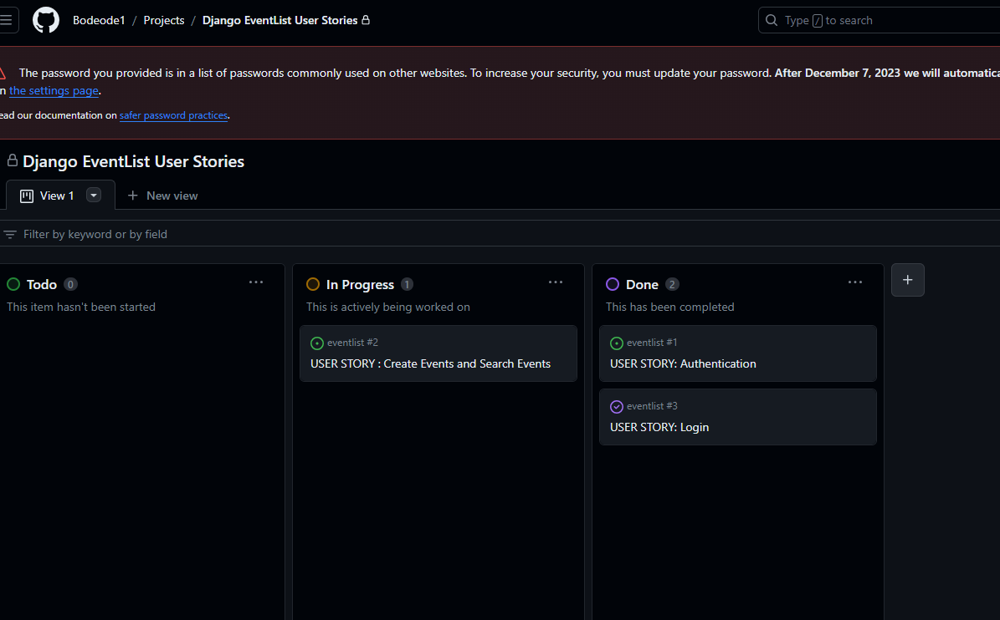  

  

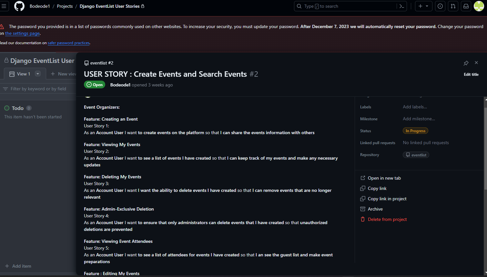 

  

## Database Design

Database schema was designed using [dbdesigner](https://erd.dbdesigner.net/).   
  

## Logic Flow Chart
Below is a comprehensive visual representation of the logic flow within this project. This flowchart outlines the sequential steps, that define the functionality and processes implemented in the system. It serves as a helpful guide to understand the underlying logic and workflow of the project.

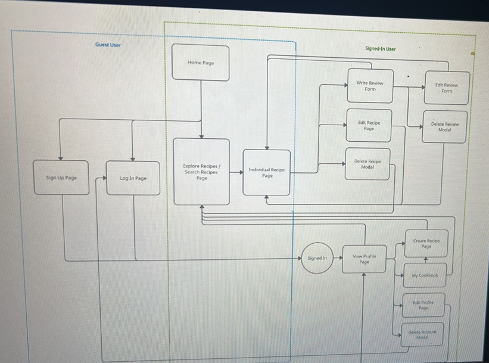  

## Scope Plane

* **Functional Requirements**   
User Authentication:  
    - The system shall allow an Administrator to create user accounts via the command line interface.
    - Users shall be able to create accounts on the website by providing username, email, password, and confirming the password.
    - Upon successful registration, users should receive a confirmation message to verify account creation.

    ### Login Functionality:
    - Users shall be able to log in to the website using the provided login form.
    - An Administrator should access the administrative dashboard via a dedicated URL login for secure system management.

Event Management:
    - Account Users shall have the capability to create events on the platform.
    - Users must have visibility of a list of events they've created, enabling them to track and update event details
    - Users should be able to delete events they've created, with restrictions to ensure only administrators can delete events created by others.
    - Account Users should view and manage the attendee list for events they've created.
    - Editing functionalities for event details should be available to Account Users.

Ticket Booking:
    - Guest Users must be able to book tickets for specific events.

* **Non-Functional Requirements**  
Security:
   - User authentication and sensitive information transmission (e.g., passwords) should be encrypted and secure.
   - Access control mechanisms should restrict unauthorized access to sensitive functionalities (e.g., event deletion).

Performance:
   - The system should respond promptly to user actions, ensuring minimal latency during event creation, updates, and bookings.

User Experience (UX):
   - The user interface should be intuitive, guiding users through registration, event creation, and management processes.

   - Responsive design principles should be employed to ensure usability across various devices and screen sizes.

Compatibility:
   - The web application should be compatible with major browsers (Chrome, Firefox, Safari, etc.) to ensure a seamless user experience.

Skeleton
Wireframes were made to showcase the appearance of the site pages while keeping a positive user experience in mind. The wireframes were created using a desktop version of [Balsamiq](https://balsamiq.com/).

Balsamiq Wireframes

    
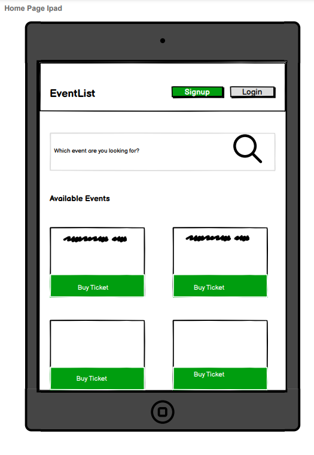

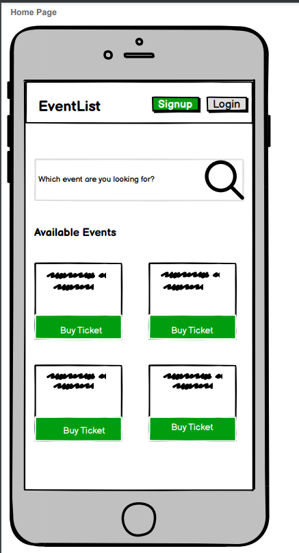

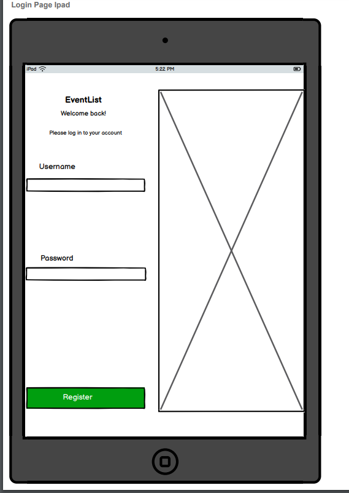

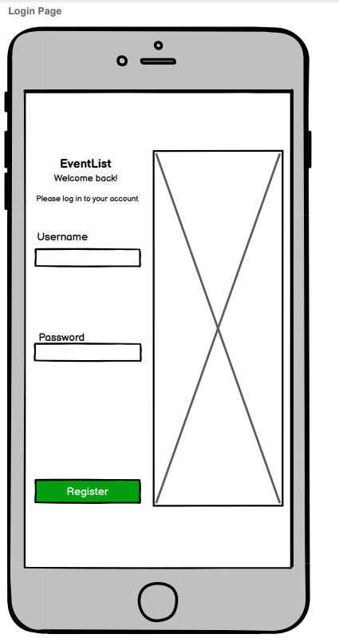

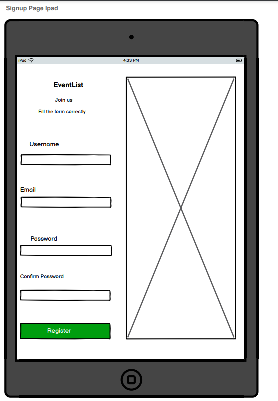

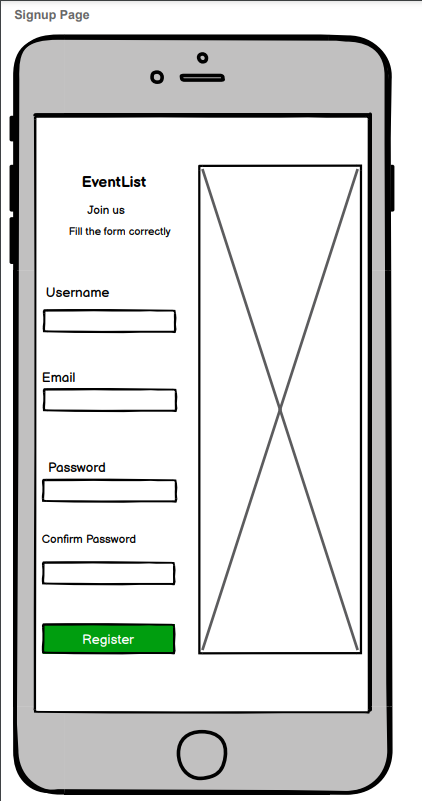

   

## Features

**MAIN SITE FEATURES**
### Design Features

### Existing Features

Home Page

The home page immediately inform the users of the purpose of the webite. 

Navigation 

The navigation bar included hypertext links to four pages: the home page (represented by the logo), the Add Event page, the login page, and the sign-up page."

Add Event Page

The "Add Event" page enables registered users to create an event for listing purposes.

The Logout Page

The logout page redirects users back to the home page.

View Event Button on Home Page

Once users have added events, they can access the event list by clicking a button on the home page.

View Tab on Event List Table
The 'View' tab within the Event List table enables users to access comprehensive details of the entire event list.

Edit Event Page

The 'Edit Event' button on the event editing page enables users to modify and save changes made to the listed event

## **Features to be implemented in the future** 
Due to time constraints on the current work project, certain features I intended to include could not be incorporated. Nevertheless, in future development phases, the following features could be considered for addition:

1. Search and Filtering Options: Enhance the search functionality by allowing users to filter events based on categories, dates, locations, or event types.

2. Interactive Event Maps: Implement interactive maps to display event locations and provide directions or additional information.

3. Social Media Integration: Enable users to share events on social media platforms and promote events through social media integration.

4. Event Reminders and Notifications: Implement reminders and notifications for users regarding upcoming events, ticket purchases, or event changes.

## Issues and Bugs
The developer ran into several issues during the development of the website, with the noteworthy ones listed below, along with solutions or ideas to implement in the future.

Bug 1

Host Error Page

When the server was launched, the website failed to load due to a disallowed host error.
I resolved this issue by adding a different host header to the Allowed Hosts section within settings.py.

Bug 2

When I oppened the website for the first time, the static files : css and javascript was not applied.
The error displayed is shown beloe. However, I managed to resolve it by removing the 'Disable_Collectstatic=1' on Heroku.

## Technologies Used

### Main Languages Used
- [HTML5](https://en.wikipedia.org/wiki/HTML5 "Link to HTML Wiki")
- [CSS3](https://en.wikipedia.org/wiki/Cascading_Style_Sheets "Link to CSS Wiki")
- [Python](https://en.wikipedia.org/wiki/Python_(programming_language) "Link to Python Wiki")

### Frameworks, Libraries & Programs Used

- [Balsamiq](https://balsamiq.com/) for wireframing
- [GitHub](https://github.com/) for repo storage and Agile project management using Kanban boards/issue tracking.
- [Heroku](https://id.heroku.com/) for project deployment to the world wide web.
- [Python3 ](https://docs.python.org/3/) with the following modules
    - asgiref==3.5.0
    - dj-database-url==0.5.0
    - Django==3.2
    - django-summernote==0.8.20.0
    - gunicorn==20.1.0
    - psycopg2==2.9.3
    - pytz==2022.1
    - sqlparse==0.4.2
- [Bootstrap](https://getbootstrap.com/)
- [Django](https://www.djangoproject.com/)
- [PostgreSQL](https://www.postgresql.org/)

## Testing

Manual Testing.
- manual testing
- Lighthouse site performance checks
- linter checks on HTML, CSS, JavaScript and Python code

Home Page

A manual test was conducted on the home page. Upon clicking the home page link, it loaded the page successfully.

View Tab on Event List Home Page

When clicking the 'View' button on the home page, it effectively enables users to access the list of created events.

Edit Event Page

A manual test was performed on the Edit Page. When clicking the edit button, it successfully loads the edit form.

Add Event Page

The Add Event page effectively displays the event creation form. Upon creating events, it accurately confirms the successful creation of events.

LightHouse Tests

The Lighthouse tests show the following results:

Resonsive Tests

The responsive tests show the the following results:

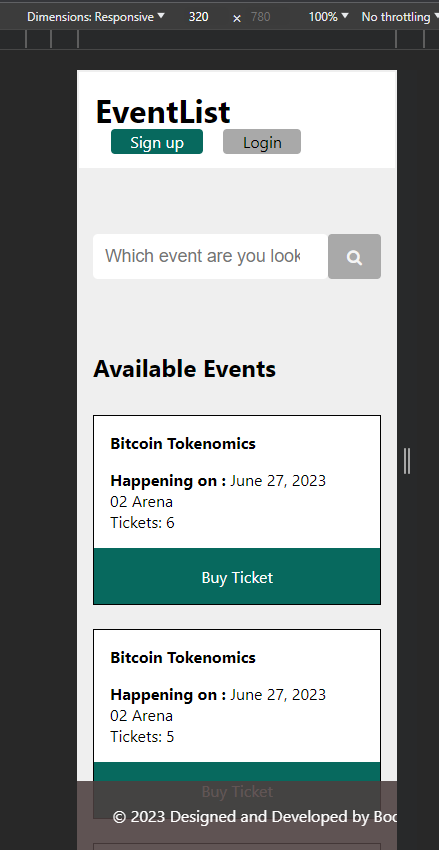

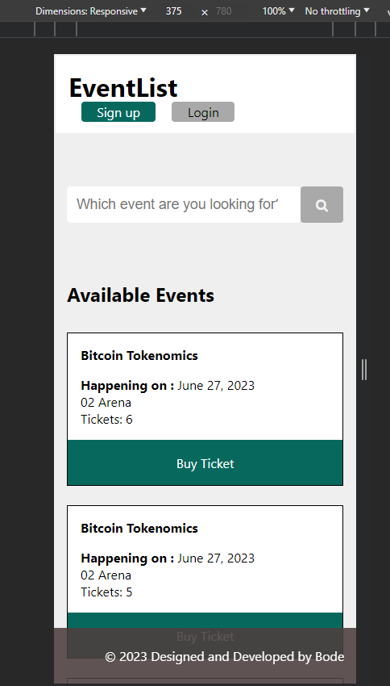

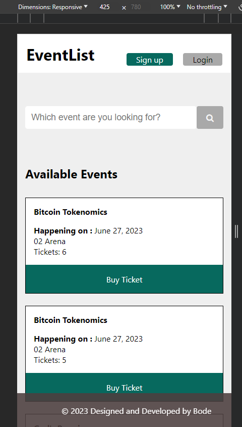

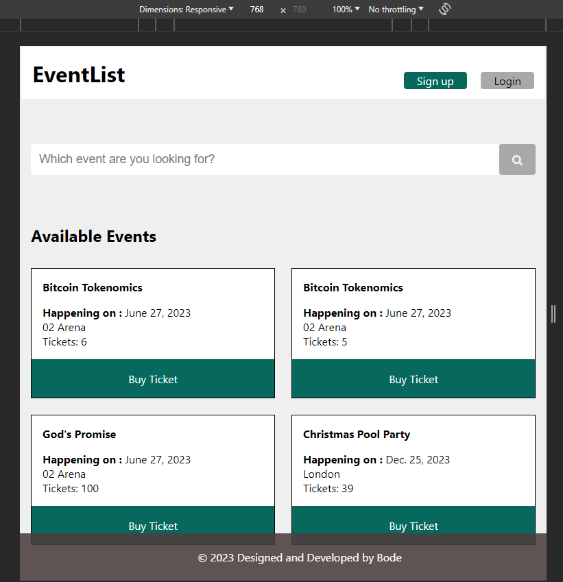

CSS Test

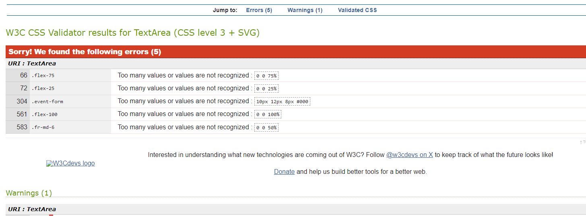

Html Test

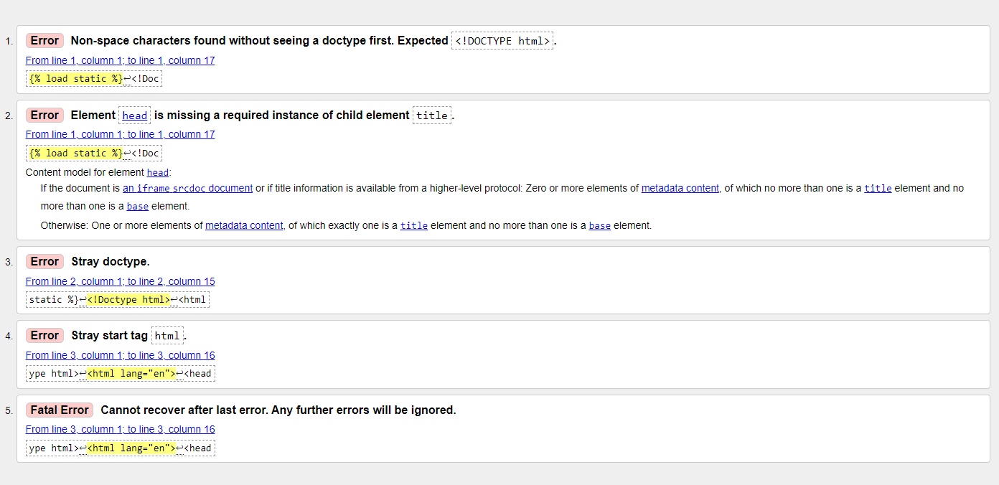

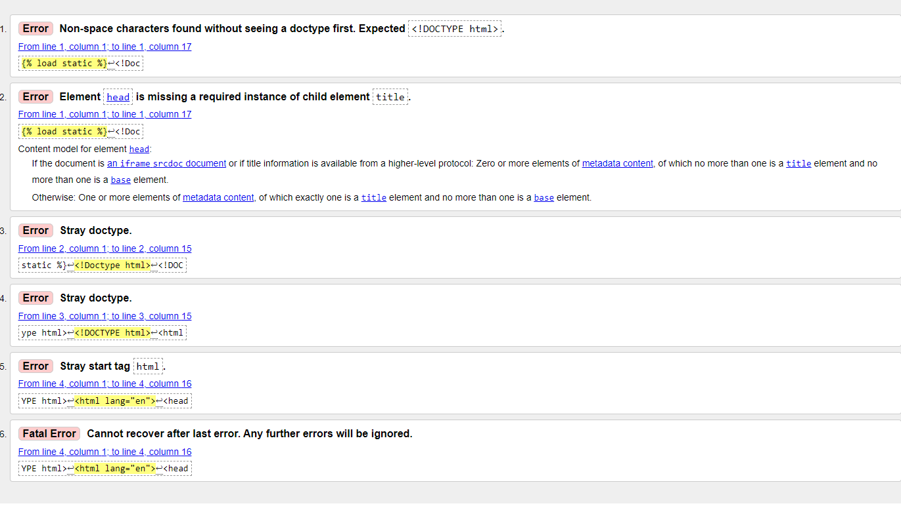

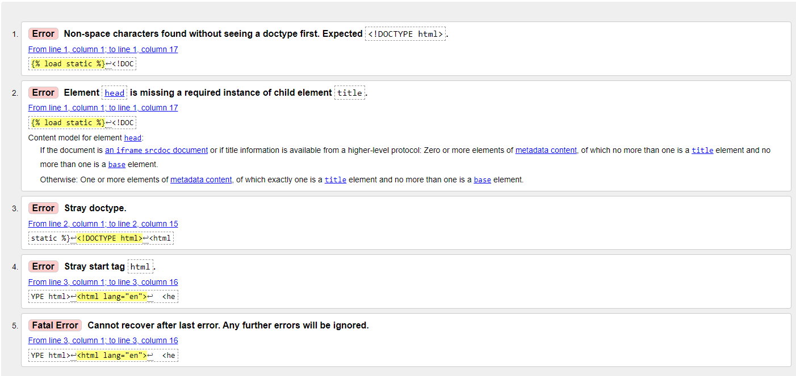

Javascript Test

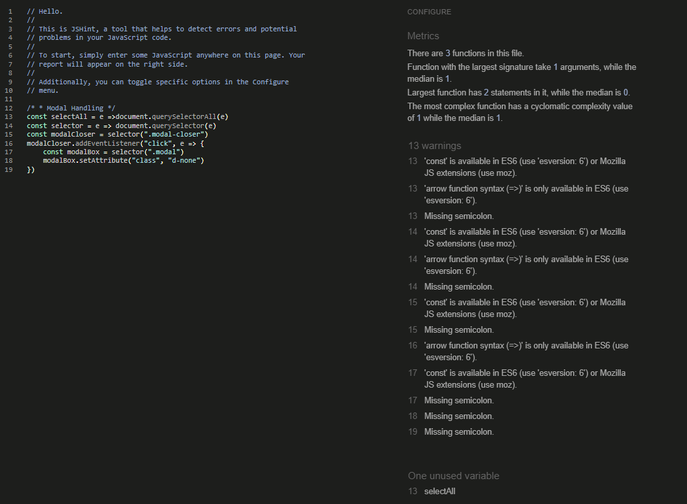

### Deployment

The site was deployed early closely following Code Institute guides.

1. Login to Heroku and enter your details.
command: Heroku login -i
2. Get your app name from Heroku.
command: Heroku apps
3. Set the Heroku remote. (Replace <app_name> with your actual app name)
command: Heroku git:remote -a <app_name>
4. Add, commit and push to GitHub
command: git add . && git commit -m "Deploy to Heroku via CLI"
5. Push to both github and Heroku
command: git push origin main
command: git push heroku main

MFA/2FA enabled?
1. Click on Account Settings (under the avatar menu)
2. Scroll down to the API Key section and click Reveal. Copy the key.
3. Enter the command: heroku_config , and enter your api key you copied when prompted
4. Complete the steps above, if you see an input box at the top middle of the editor...
 a. enter your Heroku username
 b. enter the api key you just copied

## Credits

### Content

- Signup and Login page image from [Freepik](https://www.freepik.com/search?format=search&query=event%20vector&type=vector)

### People

My thanks to:
- YouTube tutorial *Complete Django Crud Operation* by CodeAffection [CodeAffection](https://www.youtube.com/watch?v=N6jzspc2kds&t=1222s)
- [CodeInstitute](https://learn.codeinstitute.net/courses/course-v1:CodeInstitute+FST101+2021_T1/courseware/dc049b343a9b474f8d75822c5fda1582/a706dbb65b2d467a84e1bf67266851b1/) for the walkthrough project.

## Acknowledgements

- I would like to thank my wife and kids for their morale support and encouragement which has turned out to be priceless.

